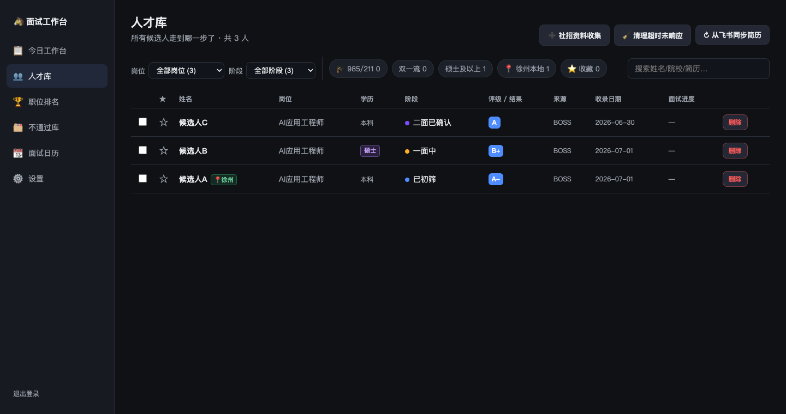
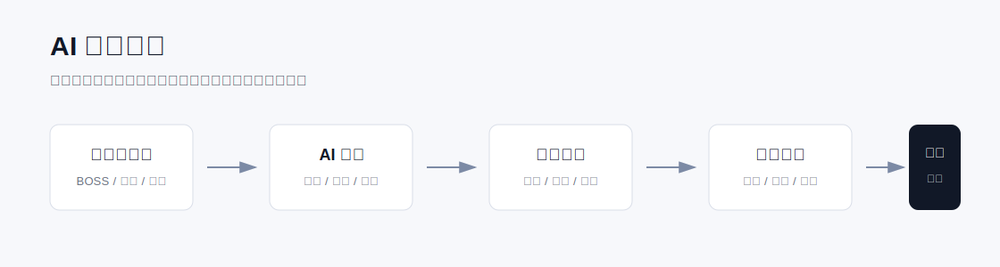
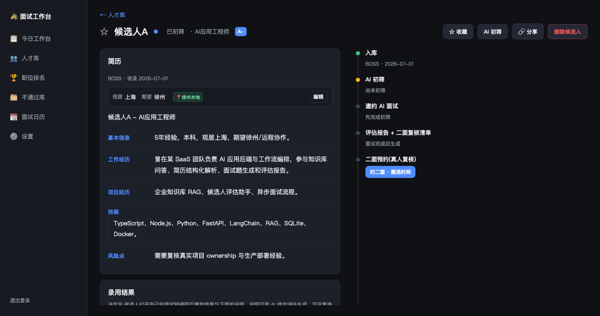
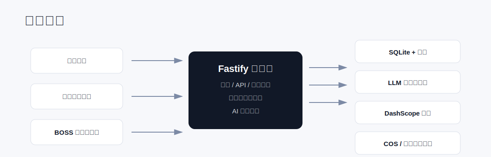

# 面试工作台

AI 驱动的招聘漏斗系统，把候选人入库、AI 初筛、异步面试、真人复核、结果反馈和数据沉淀收进一个 Web 工作台。



## 项目背景

招聘流程里最消耗人的部分，往往不是“做决定”，而是把分散的信息整理到足够可判断：BOSS 会话、在线简历、附件作品、沟通记录、面试录音、候选人时间、二面反馈和最终结论，经常散落在不同工具里。

面试工作台把这些动作收束成一个连续系统：候选人先入库，AI 做初筛和问题生成，候选人通过异步链接完成面试，系统自动转写和评估，面试官再基于复核清单做真人二面，最后沉淀结果与数据。

## 适合什么场景

- 批量处理 BOSS 等渠道来的候选人，减少重复阅读简历和手工整理。
- 用岗位画像自动生成初筛判断、风险点、面试题和复核清单。
- 让候选人通过公开链接完成异步 AI 面试，后台统一查看转写、评分和报告。
- 将二面预约、候选人阶段、结果通知和数据看板集中到同一个管理后台。

## 产品定位

面试工作台不是单点的“简历解析工具”，而是一套面向小团队和高频招聘场景的 AI 招聘操作系统。它强调三个目标：

- **把信息收回来**：从招聘前端、候选人材料、面试作答和人工反馈中形成统一候选人档案。
- **把判断结构化**：用岗位画像、证据引用、风险点、评分维度和复核问题降低主观漂移。
- **把流程跑起来**：让入库、初筛、发起面试、二面预约、结果反馈和数据备份形成闭环。



## 真实界面预览

下面的截图来自本项目本地运行的真实管理后台，使用的是脱敏样例数据。




## 核心功能

- **候选人管理**：统一记录简历、岗位方向、阶段、评级、邀约状态、面试结果和附件。
- **AI 初筛**：基于岗位画像输出推荐/待定/不推荐、证据引用、风险点和定制题。
- **异步面试**：候选人通过 token 链接完成设备检测、逐题作答、录音转写和 AI 评估。
- **真人二面**：支持预约日历、二面复核清单、面试结论和后续动作。
- **Codex 辅助入库**：提供脱敏版 `boss-resume-ingest` Skill 模板，用 Codex 从授权的 BOSS 前端页面整理候选人简历并写入工作台。
- **数据持久化**：Fastify 单后端 + SQLite，本地开发简单，生产部署可挂持久卷。
- **过渡集成**：保留飞书/lark-cli 同步脚本，便于从旧流程迁移到 SQLite。

## 架构



- `server/`：Fastify API、鉴权、SQLite 仓储、AI 服务、定时任务和第三方集成。
- `src/admin/`：管理后台，面向招聘/面试负责人。
- `src/public/`：候选人公开面试页，按 token 访问。
- `server/migrations/`：SQLite 表结构迁移。
- `scripts/`：迁移、备份和飞书过渡脚本。
- `codex-skills/boss-resume-ingest/`：脱敏版 Codex Skill，描述如何从 BOSS 前端获取简历并做脱敏入库。
- `docs/codex-boss-resume-ingest.md`：Codex + BOSS 简历获取与入库操作手册。

## Codex 获取 BOSS 简历

本仓库包含一个脱敏版 Codex Skill：[boss-resume-ingest](codex-skills/boss-resume-ingest/SKILL.md)。

它的用途是让 Codex 在用户授权的浏览器环境中读取当前 BOSS 候选人页面，把可见简历整理成脱敏 JSON，再通过 `POST /api/candidates` 写入面试工作台。完整操作步骤见：[用 Codex 从 BOSS 前端获取简历并入库](docs/codex-boss-resume-ingest.md)。

这个 Skill 是模板，不包含真实公司规则、账号信息、候选人资料、飞书 token 或 BOSS 凭据。使用前请按自己的合规要求和字段映射修改。

## 本地开发

```bash
npm install
cp .env.example .env
npm run migrate
npm run dev
```

- 管理后台：http://127.0.0.1:5173/
- 候选人页：后台生成形如 `http://127.0.0.1:5173/p/interview/<token>` 的邀约链接。
- 默认后端端口：`8787`，Vite 前端端口：`5173`。

## 生产部署

```bash
npm run build
npm start
```

生产环境建议设置：

- `NODE_ENV=production`
- `SERVE_STATIC=1`
- `DATABASE_PATH=/app/data/interview.db`
- `BACKUP_DIR=/app/backups`
- `ADMIN_PASSWORD`、`COOKIE_SECRET`、`INGEST_TOKEN`
- `DEEPSEEK_API_KEY` 或 `MIMO_API_KEY`
- `DASHSCOPE_API_KEY`

也可以使用 `Dockerfile` 部署到 Railway、Fly.io 或其他常驻 Node 服务，并把 `/app/data` 与 `/app/backups` 挂成持久卷。

## 环境变量

完整示例见 `.env.example`。本仓库不会提交真实 `.env`、SQLite 数据库、备份、候选人附件或迁移输出。

## 发布前检查

```bash
npm run build
git status --short
gh auth status
gh repo create <your-repo-name> --private --source=. --remote=origin --push
```

如果要公开仓库，请先确认 git 历史中没有候选人简历、飞书 token、数据库、录音、视频或其他个人信息。
